# Environment-Keyed Steganographic PE Loader

A Windows malware project that combines environmental keying, Shamir Secret Sharing, AES encryption, and PNG steganography.
A Windows research project exploring **environment-bound payload protection** through the combination of hardware fingerprinting, threshold secret sharing, symmetric encryption, and image steganography.

The project was built to explore how a loader can bind decryption to a specific host environment and how these techniques appear from a malware-analysis perspective. A Python builder prepares the encrypted data and generates the stub, while the C++ runtime collects system information, reconstructs the key, extracts the hidden data, and validates the recovered PE file.
The system consists of two main components:

> [!CAUTION]
> This project is for education and malware-analysis research in an isolated lab. The original `source.exe`, `msource.exe` samples are malware and is **not included in this repository**. 
* **Python Builder** – prepares the payload, derives and distributes key material, embeds the encrypted content, and generates the runtime stub.
* **C++ Stub** – retrieves host-specific information, reconstructs the encryption key, extracts the protected data, validates the recovered PE, and launches it when the required environment conditions are satisfied.

## Features
> [!WARNING]
> This repository is intended for controlled malware-analysis and security research in an isolated laboratory environment. Real malware samples used during development are intentionally excluded.

- `(3,5)` threshold environmental keying using five host attributes
- Shamir-style Secret Sharing implemented over `GF(2^8)`
- AES-128-ECB encryption with PKCS#7 padding
- Encrypted data embedded in the four least-significant bits of PNG RGBA channels
- Native Windows host fingerprinting with WinAPI, CPUID, and WMI
- Python-based builder that generates, patches, and compiles the C++ stub
- Python encoder and decoder for inspecting the steganographic container
## Project Overview

## How it works
The project investigates how a PE payload can be coupled to a specific execution environment while keeping the protected content less exposed during static inspection.

The builder takes three inputs: a target-system profile, a test executable, and a cover image.
The prototype combines several mechanisms:

1. An eight-byte key is divided byte-by-byte into five shares with a reconstruction threshold of three.
2. Five system identifiers are hashed and used to bind the share coordinates to the target environment.
3. The test executable is padded and encrypted with AES-128-ECB.
4. The encrypted bytes are embedded in an RGBA PNG image.
5. At runtime, the Windows stub collects the same five system identifiers and tries all `C(5,3) = 10` share combinations. Results are compared with real key's hash value to find the accurate one.
6. If a valid key is reconstructed, the stub extracts and decrypts the data, then checks its PE signature before executing.
* Threshold-based environment binding with a **3-of-5** recovery policy
* Shamir-style secret sharing over **GF(2^8)**
* AES-128 encryption with PKCS#7 padding
* RGBA PNG steganography using the lower four bits of image channels
* Windows-specific system fingerprinting
* Automatic C++ stub generation and compilation
* Standalone encoding and decoding utilities for laboratory testing

## Architecture

At build time, the Python pipeline receives a target environment description, a PE input, and a cover image. It prepares the cryptographic material, encrypts the payload, embeds the resulting data into the image, and produces the runtime stub.

At execution time, the stub performs the reverse process: it identifies the current host, reconstructs candidate key material, verifies the recovered key, extracts the protected content, and validates the resulting PE before execution.

```mermaid
flowchart LR
    A[Target profile] --> B[Python builder]
    C[PE malware] --> B
    B --> D[Environment-bound C++ stub]
    B --> E[Encrypted data]
    E --> F[PNG encoder]
    G[Cover image] --> F
    F --> H[Stego PNG]

    D --> I[Collect host attributes]
    I --> J{3 of 5 match?}
    H --> K[Extract encrypted data]
    J -->|Yes| L[Reconstruct key]
    L --> M[Decrypt, validate and execute PE]
    K --> M
    J -->|No| N[Stop]

    %% ===== Node styles =====

    %% Input data
    classDef input fill:#D6EAF8,stroke:#2980B9,stroke-width:2px,color:#17202A;
    class A,C,G input;

    %% Processing modules / builders
    classDef module fill:#FAD7A0,stroke:#E67E22,stroke-width:2px,color:#17202A;
    class B,F module;

    %% Generated artifacts / data
    classDef artifact fill:#D5F5E3,stroke:#27AE60,stroke-width:2px,color:#17202A;
    class D,E,H artifact;

    %% Runtime operations
    classDef runtime fill:#E8DAEF,stroke:#8E44AD,stroke-width:2px,color:#17202A;
    class I,K,L runtime;

    %% Decision
    classDef decision fill:#FCF3CF,stroke:#D4AC0D,stroke-width:2px,color:#17202A;
    class J decision;

    %% Successful final operation
    classDef success fill:#ABEBC6,stroke:#1E8449,stroke-width:3px,color:#17202A;
    class M success;

    %% Stop / rejected branch
    classDef stop fill:#F5B7B1,stroke:#C0392B,stroke-width:2px,color:#17202A;
    class N stop;
    A[Target Environment] --> B[Python Builder]
    P[Input PE] --> B
    I[Cover PNG] --> C[Steganography Encoder]

    B --> D[Generated C++ Stub]
    B --> E[Encrypted Payload]
    E --> C
    C --> F[Stego PNG]

    D --> G[Collect Host Fingerprint]
    G --> H{Threshold Satisfied?}
    F --> I2[Extract Protected Data]

    H -->|Yes| J[Reconstruct Key]
    H -->|No| K[Terminate]

    J --> L[Verify Key]
    I2 --> M[Decrypt Payload]
    L --> M
    M --> N[Validate PE]
    N --> O[Execute Payload]
```



### Environment attributes
## Environment Binding

Five system-level identifiers are currently used as environmental inputs:

The current implementation uses:
| Attribute     | Purpose                          |
| ------------- | -------------------------------- |
| MAC address   | Network interface identification |
| Computer name | Host identification              |
| Processor ID  | CPU-related identifier           |
| Volume serial | System storage identifier        |
| BIOS serial   | Firmware-related identifier      |

- MAC address
- computer name
- processor ID
- system-volume serial number
- BIOS serial number
Each raw value is normalized by hashing it with **SHA-256**, followed by XOR folding to reduce the result to a single byte.

Each value is hashed with SHA-256 and XOR-folded to one byte. The resulting bytes are combined with the secret-share coordinates during the build and recovered again by the stub at runtime.
These values are then associated with the secret-share coordinates during the build process. At runtime, the stub derives the corresponding values again and uses them to recover the original share coordinates.

### Secret reconstruction
## Threshold Key Recovery

Each byte of the research key is shared independently with a degree-two polynomial over `GF(2^8)`. The stub tests every three-share combination and verifies each reconstructed byte against its stored SHA-256 digest. This allows the experiment to continue when any three of the five environment attributes match.
The research key is processed independently on a byte-by-byte basis.

### PNG data format
For each key byte:

The steganographic image stores:
1. A degree-two polynomial is generated in `GF(2^8)`.
2. Five shares are produced from the polynomial.
3. The recovery threshold is set to **3 of 5**.
4. The runtime stub evaluates every possible three-share combination.
5. Lagrange interpolation is used to reconstruct a candidate key byte.
6. The candidate is compared against its stored SHA-256 digest.

There are:

```text
[4-byte big-endian data length][encrypted data]
C(5,3) = 10
```

Every byte is split into two four-bit values. Each value replaces the low four bits of one RGBA channel, giving a theoretical capacity of two data bytes per pixel, excluding the length header.
possible combinations for each key byte.

## Project structure
This design allows the experiment to tolerate changes in part of the host fingerprint while still requiring a sufficient number of matching environment attributes.

| File | Description |
| --- | --- |
| `demo.py` | Runs the complete build and image-encoding pipeline |
| `builder_new1.py` | Creates shares, encrypts the input, patches the stub, and invokes MSVC |
| `encrypt.py` | Implements arithmetic and secret sharing over `GF(2^8)` |
| `image_encoder.py` | Embeds encrypted data in an RGBA PNG image |
| `decoder.py` | Extracts embedded data for testing and inspection |
| `stub3 - debugged info.cpp` | C++ template containing the Windows runtime logic |
| `target_N.json` | Example schema for target-system attributes |
| `photo.png` | Cover image used by the encoder |
| `stb_image.h` | Image decoder used by the C++ stub |
## Payload Protection

`stub_ready.cpp`, `m.bin`, the compiled loader, and the steganographic output image are generated artifacts and should not be committed.
The payload-processing pipeline is composed of several stages:

## Requirements
```text
PE input
   ↓
PKCS#7 padding
   ↓
AES-128 encryption
   ↓
Binary data stream
   ↓
PNG steganographic embedding
   ↓
Protected container
```

- Windows 10 or Windows 11
- Python 3
- Visual Studio Build Tools with the MSVC C++ compiler
- [Pillow](https://pypi.org/project/pillow/)
- [PyCryptodome](https://pypi.org/project/pycryptodome/)
The PNG encoder stores:

Install the Python dependencies:
```text
[4-byte payload length][encrypted payload]
```

inside RGBA channel data.

Each payload byte is represented by two 4-bit values, which are written into the lower four bits of image channels. This provides approximately **two payload bytes per pixel**, excluding the size field.

## Runtime Processing

The generated C++ stub performs the following sequence:

```text
Collect system information
        ↓
Normalize environment attributes
        ↓
Recover share coordinates
        ↓
Evaluate 3-of-5 share combinations
        ↓
Reconstruct candidate key
        ↓
Compare SHA-256 digest
        ↓
Extract protected PNG data
        ↓
Decrypt payload
        ↓
Validate PE header
        ↓
Execute when valid
```

When the expected environment conditions are not satisfied, the reconstruction process does not produce a valid key and the runtime path terminates.

## Repository Layout

```text
.
├── demo.py
├── builder_new1.py
├── encrypt.py
├── image_encoder.py
├── decoder.py
├── stub3 - debugged info.cpp
├── target_N.json
├── photo.png
├── stb_image.h
└── README.md
```

### Main Components

| Component                   | Responsibility                                                                  |
| --------------------------- | ------------------------------------------------------------------------------- |
| `demo.py`                   | Executes the end-to-end research pipeline                                       |
| `builder_new1.py`           | Generates shares, prepares encryption, patches the stub, and builds the runtime |
| `encrypt.py`                | Implements `GF(2^8)` arithmetic and secret-sharing operations                   |
| `image_encoder.py`          | Stores encrypted data inside the PNG container                                  |
| `decoder.py`                | Extracts embedded data for analysis and testing                                 |
| `stub3 - debugged info.cpp` | C++ runtime template                                                            |
| `target_N.json`             | Example target-environment configuration                                        |
| `photo.png`                 | Cover image                                                                     |
| `stb_image.h`               | PNG decoding support for the native component                                   |

Generated files such as the compiled loader, generated source, encrypted binary data, and payload-bearing image should remain outside the public repository.

## Development Environment

The current prototype targets:

* Windows 10 / Windows 11
* Python 3
* Visual Studio / MSVC
* Pillow
* PyCryptodome

Install the Python packages with:

```powershell
python -m pip install pillow pycryptodome
```

The build script expects `cl.exe` to be available, so run it from a **Visual Studio Native Tools command prompt**.
The builder expects the Microsoft C++ compiler (`cl.exe`) to be available. A **Visual Studio Native Tools Command Prompt** is recommended for running the build pipeline.

## Usage
## Example Workflow

Prepare a JSON file containing synthetic or lab-machine values:
For a laboratory setup, prepare a synthetic target profile such as:

```json
{
@@ -149,55 +214,109 @@ Prepare a JSON file containing synthetic or lab-machine values:
}
```

Run the complete pipeline with a harmless Windows executable:
A harmless PE executable can then be supplied to the research pipeline together with the cover image.

Example:

```powershell
python demo.py --json target_N.json --payload payload.exe --image photo.png
```

The current scripts create:
The laboratory workflow produces intermediate and generated artifacts such as:

- `m.bin`: encrypted intermediate data;
- `mphoto.png`: PNG containing the encrypted data;
- `enc_msource.exe`: compiled environment-bound stub.
```text
m.bin
mphoto.png
enc_msource.exe
```

Individual components can also be explored separately:
These should not be committed to a public repository when they contain executable or payload-bearing content.

```powershell
python encrypt.py
python builder_new1.py --json target_N.json --payload payload.exe
python image_encoder.py --image photo.png
```
## Security Considerations

## Limitations
This implementation is intentionally experimental and includes several design limitations.

- The eight-byte key is hard-coded and repeated to form the AES key.
- AES-ECB does not provide semantic security or data authenticity.
- Python's `random` module is not suitable for cryptographic key material.
- Folding a SHA-256 digest to one byte makes collisions likely and weakens the environment binding.
- System identifiers are sensitive to formatting, adapter ordering, VM cloning, and hardware changes.
- Replacing four LSBs provides high capacity but may introduce visible or statistically detectable changes.
- The current runtime writes the recovered PE to disk and is neither fileless nor stealthy.
- Error handling, secure memory cleanup, automated tests, and CI are still incomplete.
### Key management

These trade-offs are part of the experiment and provide useful examples of implementation weaknesses and observable behaviors during malware analysis.
The current prototype uses a short research key and derives the AES key from that material. This is suitable for experimentation but not for production cryptography.

## Repository contents and safety
### AES mode

The private experiment used the following artifacts, none of which belong in the public repository:
AES-ECB is used to simplify the prototype. It does not provide authenticated encryption or semantic security and should not be treated as a secure production design.

- `msource.exe` — original malware sample
- `enc_msource.exe` — compiled loader from the private experiment
- `m.bin` — encrypted form of the sample
- `mphoto.png` — image containing the encrypted sample
- `stub_ready.cpp` — generated source containing build-specific values
### Randomness

Do not upload live samples, payload-bearing images, recovered executables, or real machine identifiers. Replace the values in `target_N.json` with clearly synthetic examples before publishing.
The implementation currently relies on Python's `random` module in parts of the prototype. It is not an appropriate source of cryptographic randomness.

## Disclaimer
### Environment fingerprinting

Reducing SHA-256 output to a single byte introduces a large collision space reduction. Host identifiers can also change because of VM cloning, hardware replacement, interface ordering, or formatting differences.

### Steganography

Using four low-order bits per RGBA channel provides high storage density but can introduce image artifacts or statistically detectable modifications.

### Runtime extraction

The current implementation reconstructs the PE and writes it to disk before execution. As a result, the payload remains observable through filesystem and memory-analysis techniques.

## Research Limitations

The prototype is intended as an experimental platform rather than a hardened loader. Areas that still require improvement include:

* stronger key derivation and key management
* authenticated encryption
* cryptographically secure randomness
* more robust environment normalization
* secure memory handling
* improved failure handling
* automated test coverage
* broader PE compatibility
* additional analysis against static and dynamic inspection techniques

These limitations are intentionally documented because they provide useful material for studying how implementation decisions affect malware-analysis visibility.

## Safety

This repository is intended only for education, reverse engineering, and malware research. Use it only on systems you own or have explicit permission to test. The author is not responsible for misuse or damage resulting from this project.
The following artifacts from the private laboratory environment must **not** be published:

```text
msource.exe
enc_msource.exe
m.bin
mphoto.png
stub_ready.cpp
```

Do not commit:

* live malware samples
* executable payloads
* recovered malware
* payload-bearing images
* real hardware identifiers
* credentials or other machine-specific information

Use synthetic environment data and harmless PE files when reproducing the project.

## Research Purpose

The project was created to study the interaction between:

* threshold cryptography
* environment fingerprinting
* PE execution
* steganographic data storage
* static malware analysis

The main objective is not to provide a production-ready malware loader, but to use a controlled prototype to examine how environmental binding and layered payload protection affect **key recovery, payload visibility, and static-analysis artifacts**.

## Acknowledgements

PNG decoding in the native stub uses [`stb_image`](https://github.com/nothings/stb). Its license notice is retained in `stb_image.h`.
Native PNG decoding uses [`stb_image`](https://github.com/nothings/stb).

The original license and attribution notice are retained in `stb_image.h`.

## Disclaimer

This repository is intended solely for **education, reverse engineering, malware analysis, and controlled security research**. Any experimentation should be performed only on systems and software for which you have explicit authorization.
