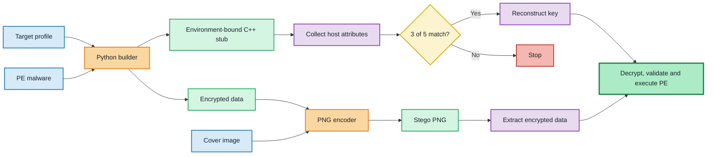

# Environment-Keyed Steganographic Loader

A Windows malware project that combines environmental keying, Shamir Secret Sharing, AES encryption, and PNG steganography.

The project was built to explore how a loader can bind decryption to a specific host environment and how these techniques appear from a malware-analysis perspective. A Python builder prepares the encrypted data and generates the stub, while the C++ runtime collects system information, reconstructs the key, extracts the hidden data, and validates the recovered PE file.

> [!CAUTION]
> This project is for education and malware-analysis research in an isolated lab. The original `source.exe`, `msource.exe` samples are malware and is **not included in this repository**. 

## Features

- `(3,5)` threshold environmental keying using five host attributes
- Shamir-style Secret Sharing implemented over `GF(2^8)`
- AES-128-ECB encryption with PKCS#7 padding
- Encrypted data embedded in the four least-significant bits of PNG RGBA channels
- Native Windows host fingerprinting with WinAPI, CPUID, and WMI
- Python-based builder that generates, patches, and compiles the C++ stub
- Python encoder and decoder for inspecting the steganographic container

## How it works

The builder takes three inputs: a target-system profile, a test executable, and a cover image.

1. An eight-byte key is divided byte-by-byte into five shares with a reconstruction threshold of three.
2. Five system identifiers are hashed and used to bind the share coordinates to the target environment.
3. The test executable is padded and encrypted with AES-128-ECB.
4. The encrypted bytes are embedded in an RGBA PNG image.
5. At runtime, the Windows stub collects the same five system identifiers and tries all `C(5,3) = 10` share combinations. Results are compared with real key's hash value to find the accurate one.
6. If a valid key is reconstructed, the stub extracts and decrypts the data, then checks its PE signature before executing.



### Environment attributes

The current implementation uses:

- MAC address
- computer name
- processor ID
- system-volume serial number
- BIOS serial number

Each value is hashed with SHA-256 and XOR-folded to one byte. The resulting bytes are combined with the secret-share coordinates during the build and recovered again by the stub at runtime.

### Secret reconstruction

Each byte of the research key is shared independently with a degree-two polynomial over `GF(2^8)`. The stub tests every three-share combination and verifies each reconstructed byte against its stored SHA-256 digest. This allows the experiment to continue when any three of the five environment attributes match.

### PNG data format

The steganographic image stores:

```text
[4-byte big-endian data length][encrypted data]
```

Every byte is split into two four-bit values. Each value replaces the low four bits of one RGBA channel, giving a theoretical capacity of two data bytes per pixel, excluding the length header.

## Project structure

| File | Description |
| --- | --- |
| `demo.py` | Runs the complete build and image-encoding pipeline |
| `builder_new1.py` | Creates shares, encrypts the input, patches the stub, and invokes MSVC |
| `encrypt.py` | Implements arithmetic and secret sharing over `GF(2^8)` |
| `image_encoder.py` | Embeds encrypted data in an RGBA PNG image |
| `decoder.py` | Extracts embedded data for testing and inspection |
| `stub3 - debugged info.cpp` | C++ template containing the Windows runtime logic |
| `target_N.json` | Example schema for target-system attributes |
| `photo.png` | Cover image used by the encoder |
| `stb_image.h` | Image decoder used by the C++ stub |

`stub_ready.cpp`, `m.bin`, the compiled loader, and the steganographic output image are generated artifacts and should not be committed.

## Requirements

- Windows 10 or Windows 11
- Python 3
- Visual Studio Build Tools with the MSVC C++ compiler
- [Pillow](https://pypi.org/project/pillow/)
- [PyCryptodome](https://pypi.org/project/pycryptodome/)

Install the Python dependencies:

```powershell
python -m pip install pillow pycryptodome
```

The build script expects `cl.exe` to be available, so run it from a **Visual Studio Native Tools command prompt**.

## Usage

Prepare a JSON file containing synthetic or lab-machine values:

```json
{
  "mac_address": "001122334455",
  "computer_name": "LAB-VM",
  "cpu_id": "0000000000000000",
  "volume_serial": "00000000",
  "bios_serial": "LAB-BIOS-SERIAL"
}
```

Run the complete pipeline with a harmless Windows executable:

```powershell
python demo.py --json target_N.json --payload payload.exe --image photo.png
```

The current scripts create:

- `m.bin`: encrypted intermediate data;
- `mphoto.png`: PNG containing the encrypted data;
- `enc_msource.exe`: compiled environment-bound stub.

Individual components can also be explored separately:

```powershell
python encrypt.py
python builder_new1.py --json target_N.json --payload payload.exe
python image_encoder.py --image photo.png
```

## Limitations

- The eight-byte key is hard-coded and repeated to form the AES key.
- AES-ECB does not provide semantic security or data authenticity.
- Python's `random` module is not suitable for cryptographic key material.
- Folding a SHA-256 digest to one byte makes collisions likely and weakens the environment binding.
- System identifiers are sensitive to formatting, adapter ordering, VM cloning, and hardware changes.
- Replacing four LSBs provides high capacity but may introduce visible or statistically detectable changes.
- The current runtime writes the recovered PE to disk and is neither fileless nor stealthy.
- Error handling, secure memory cleanup, automated tests, and CI are still incomplete.

These trade-offs are part of the experiment and provide useful examples of implementation weaknesses and observable behaviors during malware analysis.

## Repository contents and safety

The private experiment used the following artifacts, none of which belong in the public repository:

- `msource.exe` — original malware sample
- `enc_msource.exe` — compiled loader from the private experiment
- `m.bin` — encrypted form of the sample
- `mphoto.png` — image containing the encrypted sample
- `stub_ready.cpp` — generated source containing build-specific values

Do not upload live samples, payload-bearing images, recovered executables, or real machine identifiers. Replace the values in `target_N.json` with clearly synthetic examples before publishing.

## Disclaimer

This repository is intended only for education, reverse engineering, and malware research. Use it only on systems you own or have explicit permission to test. The author is not responsible for misuse or damage resulting from this project.

## Acknowledgements

PNG decoding in the native stub uses [`stb_image`](https://github.com/nothings/stb). Its license notice is retained in `stb_image.h`.
