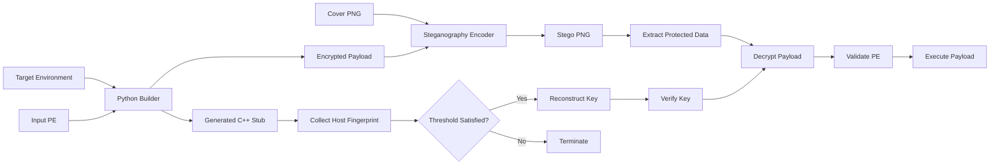

# Environment-Keyed Steganographic PE Loader

A Windows research project exploring **environment-bound payload protection** through the combination of hardware fingerprinting, threshold secret sharing, symmetric encryption, and image steganography.

The system consists of two main components:

* **Python Builder** – prepares the payload, derives and distributes key material, embeds the encrypted content, and generates the runtime stub.
* **C++ Stub** – retrieves host-specific information, reconstructs the encryption key, extracts the protected data, validates the recovered PE, and launches it when the required environment conditions are satisfied.

> [!WARNING]
> This repository is intended for controlled malware-analysis and security research in an isolated laboratory environment. Real malware samples used during development are intentionally excluded.

## Project Overview

The project investigates how a PE payload can be coupled to a specific execution environment while keeping the protected content less exposed during static inspection.

The prototype combines several mechanisms:

* Threshold-based environment binding with a **3-of-5** recovery policy
* Shamir-style secret sharing over **GF(2^8)**
* AES-128 encryption with PKCS#7 padding
* RGBA PNG steganography using the lower four bits of image channels
* Windows-specific system fingerprinting
* Automatic C++ stub generation and compilation
* Standalone encoding and decoding utilities for laboratory testing

## Architecture

At build time, the Python pipeline receives a target environment description, a PE input, and a cover image. It prepares the cryptographic material, encrypts the payload, embeds the resulting data into the image, and produces the runtime stub.

At execution time, the stub performs the reverse process: it identifies the current host, reconstructs candidate key material, verifies the recovered key, extracts the protected content, and validates the resulting PE before execution.



## Environment Binding

Five system-level identifiers are currently used as environmental inputs:

| Attribute     | Purpose                          |
| ------------- | -------------------------------- |
| MAC address   | Network interface identification |
| Computer name | Host identification              |
| Processor ID  | CPU-related identifier           |
| Volume serial | System storage identifier        |
| BIOS serial   | Firmware-related identifier      |

Each raw value is normalized by hashing it with **SHA-256**, followed by XOR folding to reduce the result to a single byte.

These values are then associated with the secret-share coordinates during the build process. At runtime, the stub derives the corresponding values again and uses them to recover the original share coordinates.

## Threshold Key Recovery

The research key is processed independently on a byte-by-byte basis.

For each key byte:

1. A degree-two polynomial is generated in `GF(2^8)`.
2. Five shares are produced from the polynomial.
3. The recovery threshold is set to **3 of 5**.
4. The runtime stub evaluates every possible three-share combination.
5. Lagrange interpolation is used to reconstruct a candidate key byte.
6. The candidate is compared against its stored SHA-256 digest.

There are:

```text
C(5,3) = 10
```

possible combinations for each key byte.

This design allows the experiment to tolerate changes in part of the host fingerprint while still requiring a sufficient number of matching environment attributes.

## Payload Protection

The payload-processing pipeline is composed of several stages:

```text
PE input
   ↓
PKCS#7 padding
   ↓
AES-128 encryption
   ↓
Binary data stream
   ↓
PNG steganographic embedding
   ↓
Protected container
```

The PNG encoder stores:

```text
[4-byte payload length][encrypted payload]
```

inside RGBA channel data.

Each payload byte is represented by two 4-bit values, which are written into the lower four bits of image channels. This provides approximately **two payload bytes per pixel**, excluding the size field.

## Runtime Processing

The generated C++ stub performs the following sequence:

```text
Collect system information
        ↓
Normalize environment attributes
        ↓
Recover share coordinates
        ↓
Evaluate 3-of-5 share combinations
        ↓
Reconstruct candidate key
        ↓
Compare SHA-256 digest
        ↓
Extract protected PNG data
        ↓
Decrypt payload
        ↓
Validate PE header
        ↓
Execute when valid
```

When the expected environment conditions are not satisfied, the reconstruction process does not produce a valid key and the runtime path terminates.

## Repository Layout

```text
.
├── demo.py
├── builder_new1.py
├── encrypt.py
├── image_encoder.py
├── decoder.py
├── stub3 - debugged info.cpp
├── target_N.json
├── photo.png
├── stb_image.h
└── README.md
```

### Main Components

| Component                   | Responsibility                                                                  |
| --------------------------- | ------------------------------------------------------------------------------- |
| `demo.py`                   | Executes the end-to-end research pipeline                                       |
| `builder_new1.py`           | Generates shares, prepares encryption, patches the stub, and builds the runtime |
| `encrypt.py`                | Implements `GF(2^8)` arithmetic and secret-sharing operations                   |
| `image_encoder.py`          | Stores encrypted data inside the PNG container                                  |
| `decoder.py`                | Extracts embedded data for analysis and testing                                 |
| `stub3 - debugged info.cpp` | C++ runtime template                                                            |
| `target_N.json`             | Example target-environment configuration                                        |
| `photo.png`                 | Cover image                                                                     |
| `stb_image.h`               | PNG decoding support for the native component                                   |

Generated files such as the compiled loader, generated source, encrypted binary data, and payload-bearing image should remain outside the public repository.

## Development Environment

The current prototype targets:

* Windows 10 / Windows 11
* Python 3
* Visual Studio / MSVC
* Pillow
* PyCryptodome

Install the Python packages with:

```powershell
python -m pip install pillow pycryptodome
```

The builder expects the Microsoft C++ compiler (`cl.exe`) to be available. A **Visual Studio Native Tools Command Prompt** is recommended for running the build pipeline.

## Example Workflow

For a laboratory setup, prepare a synthetic target profile such as:

```json
{
  "mac_address": "001122334455",
  "computer_name": "LAB-VM",
  "cpu_id": "0000000000000000",
  "volume_serial": "00000000",
  "bios_serial": "LAB-BIOS-SERIAL"
}
```

A harmless PE executable can then be supplied to the research pipeline together with the cover image.

Example:

```powershell
python demo.py --json target_N.json --payload payload.exe --image photo.png
```

The laboratory workflow produces intermediate and generated artifacts such as:

```text
m.bin
mphoto.png
enc_msource.exe
```

These should not be committed to a public repository when they contain executable or payload-bearing content.

## Security Considerations

This implementation is intentionally experimental and includes several design limitations.

### Key management

The current prototype uses a short research key and derives the AES key from that material. This is suitable for experimentation but not for production cryptography.

### AES mode

AES-ECB is used to simplify the prototype. It does not provide authenticated encryption or semantic security and should not be treated as a secure production design.

### Randomness

The implementation currently relies on Python's `random` module in parts of the prototype. It is not an appropriate source of cryptographic randomness.

### Environment fingerprinting

Reducing SHA-256 output to a single byte introduces a large collision space reduction. Host identifiers can also change because of VM cloning, hardware replacement, interface ordering, or formatting differences.

### Steganography

Using four low-order bits per RGBA channel provides high storage density but can introduce image artifacts or statistically detectable modifications.

### Runtime extraction

The current implementation reconstructs the PE and writes it to disk before execution. As a result, the payload remains observable through filesystem and memory-analysis techniques.

## Research Limitations

The prototype is intended as an experimental platform rather than a hardened loader. Areas that still require improvement include:

* stronger key derivation and key management
* authenticated encryption
* cryptographically secure randomness
* more robust environment normalization
* secure memory handling
* improved failure handling
* automated test coverage
* broader PE compatibility
* additional analysis against static and dynamic inspection techniques

These limitations are intentionally documented because they provide useful material for studying how implementation decisions affect malware-analysis visibility.

## Safety

The following artifacts from the private laboratory environment must **not** be published:

```text
msource.exe
enc_msource.exe
m.bin
mphoto.png
stub_ready.cpp
```

Do not commit:

* live malware samples
* executable payloads
* recovered malware
* payload-bearing images
* real hardware identifiers
* credentials or other machine-specific information

Use synthetic environment data and harmless PE files when reproducing the project.

## Research Purpose

The project was created to study the interaction between:

* threshold cryptography
* environment fingerprinting
* PE execution
* steganographic data storage
* static malware analysis

The main objective is not to provide a production-ready malware loader, but to use a controlled prototype to examine how environmental binding and layered payload protection affect **key recovery, payload visibility, and static-analysis artifacts**.

## Acknowledgements

Native PNG decoding uses [`stb_image`](https://github.com/nothings/stb).

The original license and attribution notice are retained in `stb_image.h`.

## Disclaimer

This repository is intended solely for **education, reverse engineering, malware analysis, and controlled security research**. Any experimentation should be performed only on systems and software for which you have explicit authorization.
